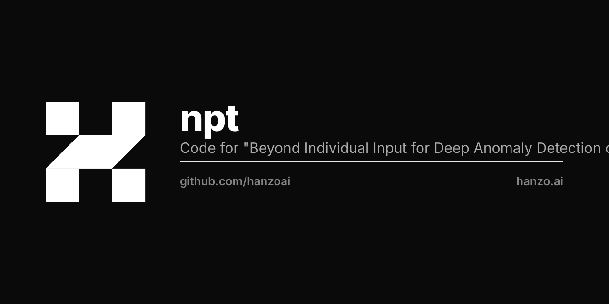

<p align="center"></p>

# NPT-AD: Non-Parametric Transformers for Anomaly Detection

[](https://arxiv.org/abs/2305.15121)
[](https://www.python.org/downloads/)
[](https://opensource.org/licenses/MIT)

Implementation of Non-Parametric Transformers for anomaly detection on tabular data.

## Overview

This repository contains of the NPT-AD (Non-Parametric Transformers for Anomaly Detection) method. The original code has been refactored to be more accessible and easier to use for both researchers and practitioners.

## Quick Start

### Installation

1. Clone the repository:
```bash
git clone git@github.com:hugothimonier/NPT-AD.git
cd NPT-AD
```

2. Create and activate the conda environment:
```bash
conda create -n nptad python=3.8
conda activate nptad
pip install -r requirements.txt
```

### Basic Usage

#### Python API

```python
from npt.simple_trainer import train_anomaly_detector
from npt.config_manager import NPTADConfig

# Base configuration with default values
config = NPTADConfig()

# modify parameters of your choice
config.training.num_total_steps = 5000
config.model.dim_hidden = 64

trainer = train_anomaly_detector('abalone', config)
```

#### Command Line Interface

```bash
# Quick test
python -m npt.cli test --dataset separable

# Train with custom settings
python -m npt.cli train --dataset abalone --steps 5000 --batch-size 32 --n_runs 5

# List available datasets
python -m npt.cli list-datasets

# Generate configuration file
python -m npt.cli config --preset small_dataset --output my_config.json
```

### Examples

Check out the `examples/` directory for comprehensive examples:

- `quick_start.py`: Basic usage examples
- `custom_dataset.py`: How to create and use custom datasets

## Configuration

NPT-AD uses a configuration system with **defaults** and **presets**.

### Presets

- `quick_test`: Fast testing with minimal resources
- `small_dataset`: Optimized for small datasets ($n<1000$).
- `small_dataset_high_d`: Optimized for small datasets ($n<1000$) with a number of features higher than 20 ($d>20$). 
- `medium_dataset`: Optimized for medium datasets ($1000<n<10,000$).
- `medium_dataset_high_d`: Optimized for medium datasets ($1000<n<10,000$) with a number of features higher than 20 ($d>20$).
- `large_dataset`: Optimized for large datasets ($n>10,000$).
- `large_dataset_high_d`: Optimized for large datasets ($n>10,000$) and a number of features higher than 20 ($d>20$). 

```bash
# Train with preset setting on a custom dataset
python -m npt.cli train --dataset custom_dataset --preset medium_dataset_high_d
```

One can also modify the preset parameters by adding arguments:

```bash
# Train with preset setting on a custom dataset
python -m npt.cli train --dataset custom_dataset --preset medium_dataset_high_d --steps 5000 --batch-size 32
```

### Custom Configuration

```python
from npt.config_manager import NPTADConfig

config = NPTADConfig()

# Model settings
config.model.dim_hidden = 128
config.model.num_heads = 8
config.model.stacking_depth = 6

# Training settings
config.training.num_total_steps = 10000
config.training.lr = 0.001
config.training.batch_size = 32

# Data settings
config.data.dataset = 'your_dataset'
config.data.data_path = 'path/to/your/data'
```

## Adding Custom Datasets

### Method 1: Using the Dataset Registry

```python
from npt.datasets.dataset_registry import create_simple_dataset, DatasetRegistry
import pandas as pd
import numpy as np

# From pandas DataFrame
df = pd.read_csv('your_data.csv')
YourDataset = create_simple_dataset(
    name='your_dataset',
    data_source=df,
    target_column='anomaly_label',
    categorical_columns=['cat_feature_1', 'cat_feature_2'],
    numerical_columns=['num_feature_1', 'num_feature_2']
)

# Register the dataset
DatasetRegistry.register('your_dataset', YourDataset)

# Use it
trainer = train_anomaly_detector('your_dataset')
```

### Method 2: Custom Dataset Class

If the former does not work, one can directly create a custom dataset class following the defined `BaseDataset` class.

```python
from npt.datasets.base import BaseDataset
import pandas as pd

class YourCustomDataset(BaseDataset):
    def __init__(self, config):
        super().__init__(fixed_test_set_index=None)
        self.config = config
        self.is_data_loaded = False
    
    def load(self):
        # Your data loading logic here
        df = pd.read_csv('your_data.csv')
        # ... process data ...
        self.is_data_loaded = True

# Register and use
DatasetRegistry.register('your_custom', YourCustomDataset)
```

## Available Datasets

The following datasets are included by default:

- `abalone`: Abalone dataset from UCI ML Repository
- `separable`: Synthetic separable dataset for testing
- `annthyroid`: Thyroid dataset
- `arrhythmia`: Arrhythmia dataset
- `backdoor`: Backdoor dataset
- `breastw`: Breast cancer dataset
- `campaign`: Campaign dataset
- `cardio`: Cardiotocography dataset
- `ecoli`: E.coli dataset
- `fraud`: Fraud dataset
- `glass`: Glass identification dataset
- `ionosphere`: Ionosphere dataset
- `letter`: Letter recognition dataset
- `lympho`: Lymphography dataset
- `mammography`: Mammography dataset
- `mnist`: Mnist dataset
- `mullcross`: Mullcross dataset
- `musk`: Musk dataset
- `optdigits`: Optical digits dataset
- `pendigits`: Pen-based digits dataset
- `pima`: Pima Indians diabetes dataset
- `satellite`: Satellite dataset
- `satimage`: Satellite image dataset
- `seismic`: Seismic dataset
- `shuttle`: Shuttle dataset
- `speech`: Speech dataset
- `thyroid`: Thyroid dataset
- `vertebral`: Vertebral column dataset
- `vowels`: Vowel dataset
- `wbc`: Wisconsin breast cancer dataset
- `wine`: Wine dataset

## Compute

### CPU

- Our code **easily runs on CPU only instances** for up to medium dataset with a reasonable number of features.
- For larger datasets, single-gpu or multi-gpu training is compatible with our codebase.

### Distributed Training

Our code is compatible with distributed training under minimal adjustments and can be launched with the usual `torchrun` command.

One can set the distributed parameters as follows:
```python
config = NPTADConfig()
config.system.distributed = True
config.system.gpus = 4
config.training.batch_size = 64

trainer = train_anomaly_detector('large_dataset', config)
```

or with the command line interface

```bash
python -m npt.cli train --dataset custom_dataset --preset medium_dataset_high_d --steps 5000 --batch-size 32 --n_gpus 4 --distributed True
```

### Cuda OOM or OOM

- During training: reduce batch size or model size (e.g. `config.model.dim_hidden`,`config.model.num_heads` or `config.model.stacking_depth`).
- During inference, reduce `config.training.num_train_inference`.

## Citation

If you use this code in your research, please cite our paper:

```bibtex
@InProceedings{pmlr-v235-thimonier24a,
    title = {Beyond Individual Input for Deep Anomaly Detection on Tabular Data},
    author = {Thimonier, Hugo and Popineau, Fabrice and Rimmel, Arpad and Doan, Bich-Li\^{e}n},
    booktitle = {Proceedings of the 41st International Conference on Machine Learning},
    pages = {48097--48123},
    year = {2024},
    volume = {235},
    series = {Proceedings of Machine Learning Research},
    month =  {21--27 Jul},
    publisher = {PMLR},
    }
```

## License

This project is licensed under the MIT License - see the LICENSE file for details.

## Acknowledgments

This work is based on the original Non-Parametric Transformers implementation from [OATML](https://github.com/OATML/non-parametric-transformers). We thank the original authors for their excellent work.